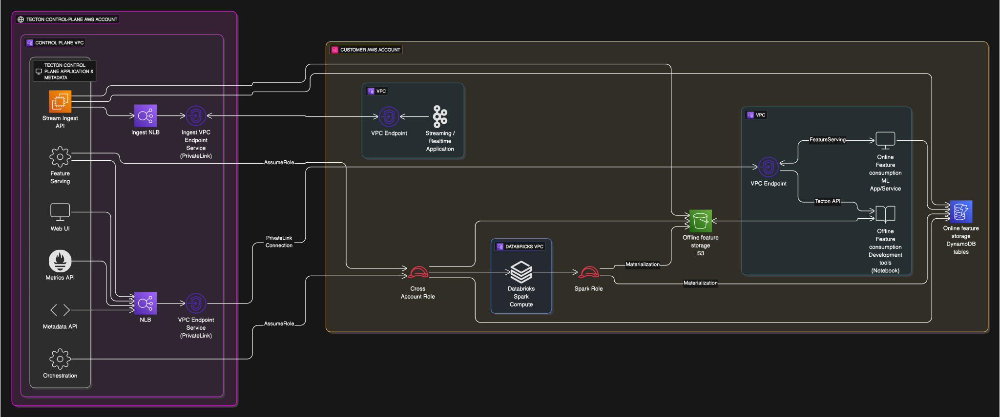

## `databricks` Tecton Module

This Terraform module deploys core Tecton resources and configures them for integration with an existing Databricks environment. It assumes that Tecton and Databricks are deployed within the same AWS account.

This module is primarily responsible for setting up the Tecton side of the integration, including IAM roles and cross-account access, leveraging an underlying Tecton deployment module.

### Using this Module

This module creates:
1.  A Tecton deployment (S3 bucket, KMS key, etc. via the `../deployment` module).
2.  IAM roles and policies required for Tecton to interact with Databricks and for Databricks Spark jobs to interact with Tecton.
3.  Cross-account IAM role for the Tecton control plane to manage resources in your account.

#### Prerequisites

Before using this module, ensure you have:
1.  An existing Databricks workspace deployed in your AWS account.
2.  The name of the IAM role and instance profile used by your Databricks Spark clusters.
3.  Your Databricks workspace URL.
4.  An AWS account and appropriate IAM permissions to create resources.
5.  Terraform installed.
6.  The following information from your Tecton representative:
    *   Tecton Control Plane Account ID
    *   Cross-Account External ID

### Sample Invocation

To use this module, add a module block like the following to your Terraform configuration. Note that the `source` will point to this module's location within your Git repository.

```terraform
provider "aws" {
  region = "us-east-1" # Replace with your desired region
}

module "tecton" {
  source = "git::https://github.com/tecton-ai/tecton-terraform-setup.git//modules/databricks?ref=<version>"
  providers = {
    aws = aws
  }

  deployment_name                 = "tecton-databricks-prod"
  region                          = "us-east-1"
  account_id                      = "123456789012"       # Your AWS Account ID
  spark_role_name                 = "DatabricksSparkRole"  # Your existing Databricks Spark IAM Role name
  spark_instance_profile_name     = "DatabricksInstanceProfile" # Your existing Databricks Instance Profile name
  databricks_workspace_url        = "mycompany.cloud.databricks.com"
  tecton_control_plane_account_id = "987654321098"       # Tecton's Control Plane Account ID
  cross_account_external_id       = "your-tecton-external-id" # External ID from Tecton
}

output "tecton" {
  value = module.tecton
}
```

### Steps to Deploy (when using this module)

1.  Ensure you have an existing Databricks setup and have gathered all prerequisite information.
2.  Create a `.tf` file (e.g., `main.tf`) with the module invocation above, replacing placeholder values with your actual data.
3.  Initialize Terraform: `terraform init`
4.  Review the plan: `terraform plan`
5.  Apply the configuration: `terraform apply`
6.  Share the output values (like `cross_account_role_arn`, S3 bucket name from `module.tecton.s3_bucket.bucket`, `kms_key_arn`) with your Tecton representative. 

### Details

<!-- BEGIN_TF_DOCS -->


## Inputs

| Name | Description | Type | Default | Required |
|------|-------------|------|---------|:--------:|
| <a name="input_account_id"></a> [account\_id](#input\_account\_id) | The AWS account ID where Tecton and Databricks are deployed. | `string` | n/a | yes |
| <a name="input_cross_account_external_id"></a> [cross\_account\_external\_id](#input\_cross\_account\_external\_id) | The external ID for cross-account access by Tecton. Obtain this from your Tecton representative. | `string` | n/a | yes |
| <a name="input_databricks_workspace_url"></a> [databricks\_workspace\_url](#input\_databricks\_workspace\_url) | The URL of your Databricks workspace (e.g., mycompany.cloud.databricks.com). | `string` | n/a | yes |
| <a name="input_deployment_name"></a> [deployment\_name](#input\_deployment\_name) | The name for your Tecton deployment. Must be less than 22 characters due to AWS S3 bucket naming limitations. | `string` | n/a | yes |
| <a name="input_kms_key_id"></a> [kms\_key\_id](#input\_kms\_key\_id) | (Optional) The customer-managed key for encrypting data at rest. | `string` | `null` | no |
| <a name="input_region"></a> [region](#input\_region) | The AWS region where Tecton and Databricks resources are deployed. | `string` | n/a | yes |
| <a name="input_spark_instance_profile_name"></a> [spark\_instance\_profile\_name](#input\_spark\_instance\_profile\_name) | The name of the IAM instance profile used by Databricks clusters. | `string` | n/a | yes |
| <a name="input_spark_role_name"></a> [spark\_role\_name](#input\_spark\_role\_name) | The name of the IAM role used by Databricks for Spark jobs. | `string` | n/a | yes |
| <a name="input_tecton_control_plane_account_id"></a> [tecton\_control\_plane\_account\_id](#input\_tecton\_control\_plane\_account\_id) | The AWS account ID of the Tecton control plane. Obtain this from your Tecton representative. | `string` | n/a | yes |  
## Outputs

| Name | Description |
|------|-------------|
| <a name="output_cross_account_external_id"></a> [cross\_account\_external\_id](#output\_cross\_account\_external\_id) | n/a |
| <a name="output_cross_account_role_arn"></a> [cross\_account\_role\_arn](#output\_cross\_account\_role\_arn) | n/a |
| <a name="output_databricks_workspace_url"></a> [databricks\_workspace\_url](#output\_databricks\_workspace\_url) | The URL of your Databricks workspace. |
| <a name="output_deployment_name"></a> [deployment\_name](#output\_deployment\_name) | n/a |
| <a name="output_kms_key_arn"></a> [kms\_key\_arn](#output\_kms\_key\_arn) | n/a |
| <a name="output_outputs_s3_uri"></a> [outputs\_s3\_uri](#output\_outputs\_s3\_uri) | S3 URI of the outputs.json file |
| <a name="output_region"></a> [region](#output\_region) | n/a |
| <a name="output_spark_instance_profile_name"></a> [spark\_instance\_profile\_name](#output\_spark\_instance\_profile\_name) | n/a |
| <a name="output_spark_role_name"></a> [spark\_role\_name](#output\_spark\_role\_name) | n/a |
<!-- END_TF_DOCS -->
