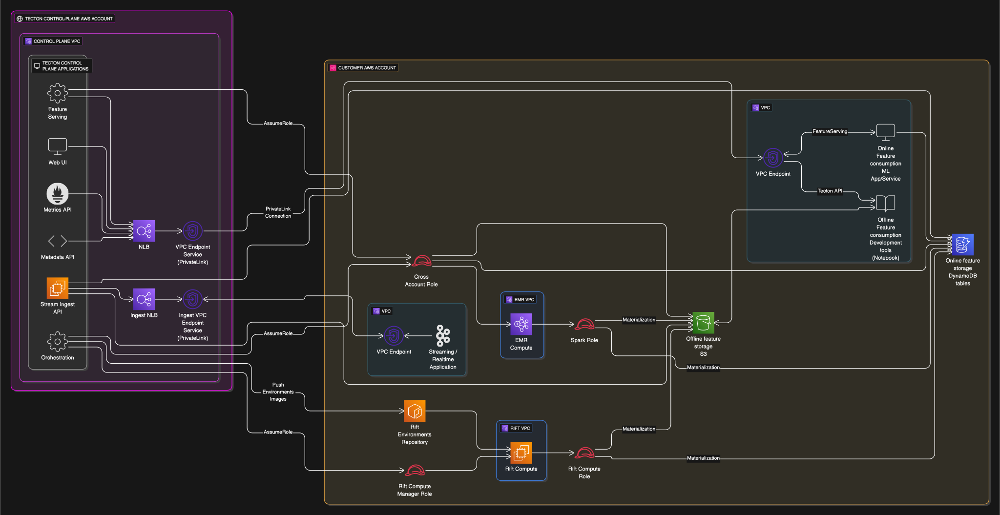

## `dataplane_rift_with_emr` Module

This Terraform module deploys a Tecton environment with the following features:
*   [**Rift Compute Engine**](https://docs.tecton.ai/docs/concepts/compute-in-tecton#rift) running in your (data-plane) account.
*   **EMR Compute**: Includes resources for running Tecton materialization via Spark on EMR in your account.
*   **Optional EMR Notebook Cluster**: For interactive development and debugging. Can be added after the deployment is complete.

This module is designed for users running a Tecton setup with Rift compute in the data-plane, alongside EMR/Spark compute.

### Using this Module

#### Prerequisites

Before using this module, ensure you have:
1.  An AWS account and appropriate IAM permissions to create resources.
2.  Terraform installed.
3.  The following information from your Tecton representative:
    *   Tecton Control Plane Account ID
    *   Cross-Account External ID
    *   Tecton Control plane IAM Role Name


```terraform
provider "aws" {
  region = "us-west-2" # Replace with your desired region
}

module "tecton" {
  source = "git::https://github.com/tecton-ai/tecton-terraform-setup.git//modules/dataplane_rift_with_emr?ref=<version>"
  providers = {
    aws = aws
  }

  deployment_name                    = "my-tecton-deployment" # Replace with the deployment name agreed with Tecton
  region                             = "us-west-2" # Replace with the region your account/Tecton deployment will use
  account_id                         = "123456789012"     # Replace with your AWS Account ID
  subnet_azs                         = ["us-west-2a", "us-west-2b", "us-west-2c"]  # Replace with AZs in the region of your choice
  tecton_control_plane_account_id    = "987654321098"     # Replace with Tecton's Control Plane Account ID
  cross_account_external_id          = "your-external-id" # Replace with the External ID from Tecton
  tecton_control_plane_role_name     = "TectonControlPlaneRole" # Role name from Tecton
  include_crossaccount_bucket_access = false

  # Get outputs destination URL from Tecton
  outputs_location_config = {
    type = "tecton_presigned_write_url"
    tecton_presigned_write_url  = ""
  }

  # (OPTIONAL)
  # To enable the EMR notebook cluster (Only uncomment all lines below _after_ you have already applied once and control plane deployment is complete):
  # notebook_cluster_count = 1
  # notebook_instance_type = "r5.xlarge" # Optional, default is m5.xlarge
  # To enable EMR debugging for Tecton support (requires notebook_cluster_count = 1):
  # emr_debugging_count = 1
}

output "tecton" {
  value = module.tecton
}
```

### Steps to Deploy

1.  Create a `.tf` file (e.g., `tecton_emr_setup.tf`) with the module invocation above, providing your specific values.
2.  Initialize Terraform: `terraform init`
3.  Review the plan: `terraform plan`
4.  Apply the configuration: `terraform apply`
5.  Notify your Tecton representative and wait for Tecton to complete/finalize deployment.

### 

This module provisions:
1.  Base Tecton deployment resources (IAM roles for cross-account access, S3 bucket, KMS key).
2.  Rift compute engine resources (IAM Roles, VPC, ECR repository, etc.).
3.  EMR-specific networking (VPC, subnets).
4.  EMR security groups.
5.  IAM roles required for Tecton to manage EMR clusters.
6.  Writes outputs (IAM role ARNs, resource IDs) to shared location (S3) for Tecton to pull.
7.  Optionally, an EMR notebook cluster for interactive use.
8.  Optionally, IAM permissions to allow Tecton support to debug EMR issues.

### Details



#### Inputs
<!-- BEGIN_TF_DOCS -->


## Inputs

| Name | Description | Type | Default | Required |
|------|-------------|------|---------|:--------:|
| <a name="input_account_id"></a> [account\_id](#input\_account\_id) | The AWS account ID where Tecton will be deployed. | `string` | n/a | yes |
| <a name="input_additional_allowed_egress_domains"></a> [additional\_allowed\_egress\_domains](#input\_additional\_allowed\_egress\_domains) | (Optional) List of additional domains to allow for egress if use\_network\_firewall is true. Only works if using VPC managed by this module (i.e. existing\_vpc is not provided). | `list(string)` | `null` | no |
| <a name="input_additional_s3_read_access_buckets"></a> [additional\_s3\_read\_access\_buckets](#input\_additional\_s3\_read\_access\_buckets) | (Optional) List of additional S3 bucket names in the dataplane account that the rift compute role should have read access to. | `list(string)` | `[]` | no |
| <a name="input_controlplane_access_only"></a> [controlplane\_access\_only](#input\_controlplane\_access\_only) | Whether to only grant control-plane account access to the cross-account role | `bool` | `true` | no |
| <a name="input_cross_account_external_id"></a> [cross\_account\_external\_id](#input\_cross\_account\_external\_id) | The external ID for cross-account access. Obtain this from your Tecton representative. | `string` | n/a | yes |
| <a name="input_deployment_name"></a> [deployment\_name](#input\_deployment\_name) | The name of the Tecton deployment. Must be less than 22 characters due to AWS limitations. | `string` | n/a | yes |
| <a name="input_emr_debugging_count"></a> [emr\_debugging\_count](#input\_emr\_debugging\_count) | Set to 1 to allow Tecton to debug EMR clusters. Set to 0 to disable. Requires Tecton deployment. | `number` | `0` | no |
| <a name="input_existing_rift_compute_security_group_id"></a> [existing\_rift\_compute\_security\_group\_id](#input\_existing\_rift\_compute\_security\_group\_id) | (Optional) The ID of the existing security group to use for Rift compute instances. | `string` | `null` | no |
| <a name="input_existing_vpc"></a> [existing\_vpc](#input\_existing\_vpc) | (Optional) Configuration for using an existing VPC. If provided, both vpc\_id and private\_subnet\_ids must be provided together. | <pre>object({<br/>    vpc_id               = string<br/>    private_subnet_ids   = list(string)<br/>  })</pre> | `null` | no |
| <a name="input_include_crossaccount_bucket_access"></a> [include\_crossaccount\_bucket\_access](#input\_include\_crossaccount\_bucket\_access) | Whether to grant direct cross-account bucket access | `bool` | `true` | no |
| <a name="input_kms_key_id"></a> [kms\_key\_id](#input\_kms\_key\_id) | (Optional) The customer-managed key for encrypting data at rest. | `string` | `null` | no |
| <a name="input_notebook_cluster_count"></a> [notebook\_cluster\_count](#input\_notebook\_cluster\_count) | Set to 1 to create the EMR notebook cluster. Set to 0 to disable. Requires Tecton deployment to be confirmed by your Tecton rep. | `number` | `0` | no |
| <a name="input_notebook_extra_bootstrap_actions"></a> [notebook\_extra\_bootstrap\_actions](#input\_notebook\_extra\_bootstrap\_actions) | (Optional) List of extra bootstrap actions for the EMR notebook cluster. | <pre>list(object({<br/>    name = string<br/>    path = string<br/>  }))</pre> | `null` | no |
| <a name="input_notebook_glue_account_id"></a> [notebook\_glue\_account\_id](#input\_notebook\_glue\_account\_id) | (Optional) The AWS account ID for Glue Data Catalog access. Defaults to the main account\_id if not specified. | `string` | `null` | no |
| <a name="input_notebook_has_glue"></a> [notebook\_has\_glue](#input\_notebook\_has\_glue) | (Optional) Whether the EMR notebook cluster should have Glue Data Catalog access. | `bool` | `true` | no |
| <a name="input_notebook_instance_type"></a> [notebook\_instance\_type](#input\_notebook\_instance\_type) | (Optional) The EC2 instance type for the EMR notebook cluster. | `string` | `"m5.xlarge"` | no |
| <a name="input_outputs_location_config"></a> [outputs\_location\_config](#input\_outputs\_location\_config) | Configuration for where to store the outputs. Defaults to creating a dedicated bucket. | <pre>object({<br/>    type = string # "new_bucket", "offline_store_bucket_path", or "tecton_hosted_presigned"<br/>    <br/>    # For offline_store_bucket_path (bucket name is automatically set to the deployment's offline store bucket)<br/>    offline_store_bucket_name    = optional(string)<br/>    offline_store_bucket_path_prefix = optional(string, "internal/tecton-outputs/")<br/>    <br/>    # For tecton_hosted_presigned<br/>    tecton_presigned_write_url = optional(string)<br/>  })</pre> | <pre>{<br/>  "type": "new_bucket"<br/>}</pre> | no |
| <a name="input_region"></a> [region](#input\_region) | The AWS region for the Tecton deployment. | `string` | n/a | yes |
| <a name="input_subnet_azs"></a> [subnet\_azs](#input\_subnet\_azs) | A list of Availability Zones for the subnets. | `list(string)` | n/a | yes |
| <a name="input_tecton_control_plane_account_id"></a> [tecton\_control\_plane\_account\_id](#input\_tecton\_control\_plane\_account\_id) | The AWS account ID of the Tecton control plane. Obtain this from your Tecton representative. | `string` | n/a | yes |
| <a name="input_tecton_control_plane_role_name"></a> [tecton\_control\_plane\_role\_name](#input\_tecton\_control\_plane\_role\_name) | The name of the Tecton control plane IAM role. Obtain this from your Tecton representative. | `string` | n/a | yes |
| <a name="input_tecton_privatelink_egress_rules"></a> [tecton\_privatelink\_egress\_rules](#input\_tecton\_privatelink\_egress\_rules) | (Optional) List of egress rules for the Tecton PrivateLink security group. | <pre>list(object({<br/>    cidr        = string<br/>    from_port   = number<br/>    to_port     = number<br/>    protocol    = string<br/>    description = string<br/>  }))</pre> | `[]` | no |
| <a name="input_tecton_privatelink_ingress_rules"></a> [tecton\_privatelink\_ingress\_rules](#input\_tecton\_privatelink\_ingress\_rules) | (Optional) List of ingress rules for the Tecton PrivateLink security group. | <pre>list(object({<br/>    cidr        = string<br/>    from_port   = number<br/>    to_port     = number<br/>    protocol    = string<br/>    description = string<br/>  }))</pre> | `[]` | no |
| <a name="input_tecton_vpce_service_name"></a> [tecton\_vpce\_service\_name](#input\_tecton\_vpce\_service\_name) | (Optional) The VPC endpoint service name for Tecton. Only needed if using PrivateLink. | `string` | `null` | no |
| <a name="input_use_network_firewall"></a> [use\_network\_firewall](#input\_use\_network\_firewall) | (Optional) Set to true to restrict egress from Rift compute using a network firewall. Only works if using VPC managed by this module (i.e. existing\_vpc is not provided). | `bool` | `false` | no |  
## Outputs

| Name | Description |
|------|-------------|
| <a name="output_anyscale_docker_target_repo"></a> [anyscale\_docker\_target\_repo](#output\_anyscale\_docker\_target\_repo) | n/a |
| <a name="output_compute_arn"></a> [compute\_arn](#output\_compute\_arn) | n/a |
| <a name="output_compute_instance_profile_arn"></a> [compute\_instance\_profile\_arn](#output\_compute\_instance\_profile\_arn) | n/a |
| <a name="output_compute_manager_arn"></a> [compute\_manager\_arn](#output\_compute\_manager\_arn) | n/a |
| <a name="output_cross_account_external_id"></a> [cross\_account\_external\_id](#output\_cross\_account\_external\_id) | n/a |
| <a name="output_cross_account_role_arn"></a> [cross\_account\_role\_arn](#output\_cross\_account\_role\_arn) | n/a |
| <a name="output_dataplane_account_id"></a> [dataplane\_account\_id](#output\_dataplane\_account\_id) | n/a |
| <a name="output_deployment_name"></a> [deployment\_name](#output\_deployment\_name) | n/a |
| <a name="output_emr_master_role_arn"></a> [emr\_master\_role\_arn](#output\_emr\_master\_role\_arn) | n/a |
| <a name="output_emr_security_group_id"></a> [emr\_security\_group\_id](#output\_emr\_security\_group\_id) | EMR security group outputs |
| <a name="output_emr_service_security_group_id"></a> [emr\_service\_security\_group\_id](#output\_emr\_service\_security\_group\_id) | n/a |
| <a name="output_emr_subnet_id"></a> [emr\_subnet\_id](#output\_emr\_subnet\_id) | n/a |
| <a name="output_emr_subnet_route_table_ids"></a> [emr\_subnet\_route\_table\_ids](#output\_emr\_subnet\_route\_table\_ids) | n/a |
| <a name="output_kms_key_arn"></a> [kms\_key\_arn](#output\_kms\_key\_arn) | n/a |
| <a name="output_nat_gateway_public_ips"></a> [nat\_gateway\_public\_ips](#output\_nat\_gateway\_public\_ips) | n/a |
| <a name="output_outputs_s3_uri"></a> [outputs\_s3\_uri](#output\_outputs\_s3\_uri) | S3 URI of the outputs.json file |
| <a name="output_region"></a> [region](#output\_region) | n/a |
| <a name="output_rift_compute_security_group_id"></a> [rift\_compute\_security\_group\_id](#output\_rift\_compute\_security\_group\_id) | n/a |
| <a name="output_spark_instance_profile_arn"></a> [spark\_instance\_profile\_arn](#output\_spark\_instance\_profile\_arn) | n/a |
| <a name="output_spark_role_arn"></a> [spark\_role\_arn](#output\_spark\_role\_arn) | n/a |
| <a name="output_vm_workload_subnet_ids"></a> [vm\_workload\_subnet\_ids](#output\_vm\_workload\_subnet\_ids) | n/a |
| <a name="output_vpc_id"></a> [vpc\_id](#output\_vpc\_id) | EMR VPC and subnet outputs |
<!-- END_TF_DOCS -->
