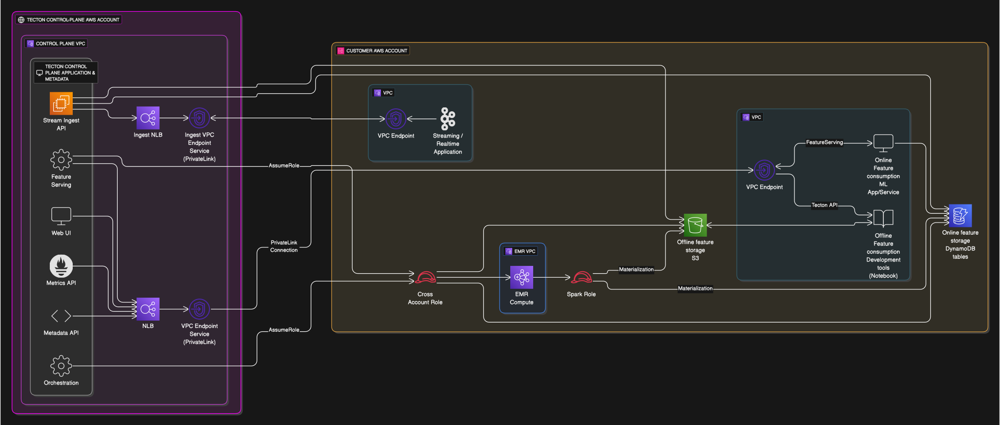

## `emr` Tecton Module

This Terraform module deploys a comprehensive Tecton environment integrated with AWS EMR (Elastic MapReduce). It sets up the necessary Tecton data plane resources, EMR-specific infrastructure (VPC, subnets, security groups), and IAM roles for Tecton-managed EMR clusters. This module also includes options for deploying an EMR notebook cluster for interactive development and Redis as an alternative online store.

This module is suitable for users who want Tecton to manage their EMR clusters for Spark-based workloads, with the Tecton control plane managed by Tecton.

### Using this Module

This module provisions:
1.  Core Tecton deployment resources (S3 bucket, KMS key, cross-account IAM role via `../deployment`).
2.  EMR-specific networking (VPC, subnets using `../emr/vpc_subnets`).
3.  EMR security groups (using `../emr/security_groups`).
4.  IAM roles for Tecton-managed EMR (via `../deployment` with `create_emr_roles = true`).
5.  Writes outputs (IAM role ARNs, resource IDs) to shared location (S3) for Tecton to pull.
6.  Optionally, Redis for an online store (using `../emr/redis`).
7.  Optionally, an EMR notebook cluster (using `../emr/notebook_cluster`).
8.  Optionally, EMR debugging permissions for Tecton support (using `../emr/debugging`).

### Sample Invocation

```terraform
provider "aws" {
  region = "us-east-1" # Replace with your desired region
}

module "tecton" {
  source = "git::https://github.com/tecton-ai/tecton-terraform-setup.git//modules/emr?ref=<version>"
  providers = {
    aws = aws
  }

  deployment_name                 = "tecton-prod-emr"
  region                          = "us-east-1"
  account_id                      = "123456789012"       # Your AWS Account ID
  tecton_control_plane_account_id = "987654321098"       # Tecton's Control Plane Account ID
  cross_account_external_id       = "your-tecton-external-id" # External ID from Tecton

  # Get outputs destination URL from Tecton
  outputs_location_config = {
    type = "tecton_hosted_presigned"
    tecton_presigned_write_url  = ""
  }

  # Optional: Enable EMR Notebook cluster
  # enable_notebook_cluster = true
  # notebook_instance_type  = "r5.xlarge" # Optional, default is m5.xlarge

  # Optional: Enable EMR debugging (requires notebook cluster)
  # enable_emr_debugging    = true

  # Optional: Enable Redis
  # enable_redis            = true
}

output "tecton" {
  value = module.tecton
}
```

### Steps to Deploy

1.  Gather prerequisite information, especially from your Tecton representative.
2.  Create a `.tf` file (e.g., `main_emr.tf`) with the module invocation, customizing values as needed.
3.  Initialize Terraform: `terraform init`
4.  Review the execution plan: `terraform plan`
5.  Apply the configuration: `terraform apply`
6.  Notify your Tecton representative and wait for Tecton to complete/finalize deployment.

#### Prerequisites

Before using this module, ensure you have:
1.  An AWS account and appropriate IAM permissions.
2.  Terraform installed.
3.  Information from your Tecton representative:
    *   Tecton Control Plane Account ID
    *   Cross-Account External ID

### Details



<!-- BEGIN_TF_DOCS -->

## Providers

| Name | Version |
|------|---------|
| <a name="provider_aws"></a> [aws](#provider\_aws) | ~> 4.60 |
## Inputs

| Name | Description | Type | Default | Required |
|------|-------------|------|---------|:--------:|
| <a name="input_account_id"></a> [account\_id](#input\_account\_id) | The AWS account ID where Tecton and EMR resources will be deployed. | `string` | n/a | yes |
| <a name="input_cross_account_external_id"></a> [cross\_account\_external\_id](#input\_cross\_account\_external\_id) | The external ID for cross-account access by Tecton. Obtain this from your Tecton representative. | `string` | n/a | yes |
| <a name="input_cross_account_principal_arn_for_s3_policy"></a> [cross\_account\_principal\_arn\_for\_s3\_policy](#input\_cross\_account\_principal\_arn\_for\_s3\_policy) | (Optional) The ARN of the principal in another account that should get read-only access to the Tecton S3 bucket. Used if setting up cross-account EMR notebooks manually or extending this module. | `string` | `null` | no |
| <a name="input_deployment_name"></a> [deployment\_name](#input\_deployment\_name) | The name for your Tecton deployment. Must be less than 22 characters due to AWS S3 bucket naming limitations. | `string` | n/a | yes |
| <a name="input_emr_notebook_cross_account_external_id"></a> [emr\_notebook\_cross\_account\_external\_id](#input\_emr\_notebook\_cross\_account\_external\_id) | (Optional) The external ID for cross-account access by the EMR notebook cluster. | `string` | `null` | no |
| <a name="input_emr_notebook_cross_account_region"></a> [emr\_notebook\_cross\_account\_region](#input\_emr\_notebook\_cross\_account\_region) | (Optional) The AWS region of the cross-account EMR notebook cluster. | `string` | `null` | no |
| <a name="input_emr_notebook_cross_account_role_arn"></a> [emr\_notebook\_cross\_account\_role\_arn](#input\_emr\_notebook\_cross\_account\_role\_arn) | (Optional) The ARN of the role in the cross-account EMR notebook cluster. | `string` | `null` | no |
| <a name="input_enable_cross_account_emr_notebook_cluster"></a> [enable\_cross\_account\_emr\_notebook\_cluster](#input\_enable\_cross\_account\_emr\_notebook\_cluster) | (Optional) Set to true to include a cross-account EMR notebook cluster. Requires also setting: emr\_notebook\_cross\_account\_region, emr\_notebook\_cross\_account\_role\_arn, emr\_notebook\_cross\_account\_external\_id, and cross\_account\_principal\_arn\_for\_s3\_policy. | `bool` | `false` | no |
| <a name="input_enable_emr_debugging"></a> [enable\_emr\_debugging](#input\_enable\_emr\_debugging) | Set to true to enable EMR debugging permissions for Tecton support. Requires enable\_notebook\_cluster to be true. | `bool` | `false` | no |
| <a name="input_enable_notebook_cluster"></a> [enable\_notebook\_cluster](#input\_enable\_notebook\_cluster) | Set to true to create an EMR notebook cluster. Requires Tecton deployment to be confirmed by your Tecton rep. | `bool` | `false` | no |
| <a name="input_enable_redis"></a> [enable\_redis](#input\_enable\_redis) | Set to true to deploy Redis as an online store. Default is false (DynamoDB is used). | `bool` | `false` | no |
| <a name="input_kms_key_id"></a> [kms\_key\_id](#input\_kms\_key\_id) | (Optional) The customer-managed key for encrypting data at rest. | `string` | `null` | no |
| <a name="input_notebook_extra_bootstrap_actions"></a> [notebook\_extra\_bootstrap\_actions](#input\_notebook\_extra\_bootstrap\_actions) | (Optional) List of extra bootstrap actions for the EMR notebook cluster. | <pre>list(object({<br/>    name = string<br/>    path = string # S3 path to the script<br/>  }))</pre> | `null` | no |
| <a name="input_notebook_glue_account_id"></a> [notebook\_glue\_account\_id](#input\_notebook\_glue\_account\_id) | (Optional) The AWS account ID for Glue Data Catalog access for the notebook. Defaults to the main account\_id if not specified (and notebook\_has\_glue is true). | `string` | `null` | no |
| <a name="input_notebook_has_glue"></a> [notebook\_has\_glue](#input\_notebook\_has\_glue) | (Optional) Whether the EMR notebook cluster should have Glue Data Catalog access. | `bool` | `true` | no |
| <a name="input_notebook_instance_type"></a> [notebook\_instance\_type](#input\_notebook\_instance\_type) | (Optional) The EC2 instance type for the EMR notebook cluster. | `string` | `"m5.xlarge"` | no |
| <a name="input_outputs_location_config"></a> [outputs\_location\_config](#input\_outputs\_location\_config) | Configuration for where to store the outputs. Defaults to creating a dedicated bucket. | <pre>object({<br/>    type = string # "new_bucket", "offline_store_bucket_path", or "tecton_hosted_presigned"<br/>    <br/>    # For offline_store_bucket_path (bucket name is automatically set to the deployment's offline store bucket)<br/>    offline_store_bucket_name    = optional(string)<br/>    offline_store_bucket_path_prefix = optional(string, "internal/tecton-outputs/")<br/>    <br/>    # For tecton_hosted_presigned<br/>    tecton_presigned_write_url = optional(string)<br/>  })</pre> | <pre>{<br/>  "type": "tecton_hosted_presigned"<br/>}</pre> | no |
| <a name="input_region"></a> [region](#input\_region) | The AWS region for the Tecton and EMR deployment. | `string` | n/a | yes |
| <a name="input_tecton_control_plane_account_id"></a> [tecton\_control\_plane\_account\_id](#input\_tecton\_control\_plane\_account\_id) | The AWS account ID of the Tecton control plane. Obtain this from your Tecton representative. | `string` | n/a | yes |  
## Outputs

| Name | Description |
|------|-------------|
| <a name="output_cross_account_external_id"></a> [cross\_account\_external\_id](#output\_cross\_account\_external\_id) | n/a |
| <a name="output_cross_account_role_arn"></a> [cross\_account\_role\_arn](#output\_cross\_account\_role\_arn) | n/a |
| <a name="output_dataplane_account_id"></a> [dataplane\_account\_id](#output\_dataplane\_account\_id) | n/a |
| <a name="output_deployment_name"></a> [deployment\_name](#output\_deployment\_name) | n/a |
| <a name="output_emr_master_role_arn"></a> [emr\_master\_role\_arn](#output\_emr\_master\_role\_arn) | n/a |
| <a name="output_emr_security_group_id"></a> [emr\_security\_group\_id](#output\_emr\_security\_group\_id) | EMR security group outputs |
| <a name="output_emr_service_security_group_id"></a> [emr\_service\_security\_group\_id](#output\_emr\_service\_security\_group\_id) | n/a |
| <a name="output_emr_subnet_id"></a> [emr\_subnet\_id](#output\_emr\_subnet\_id) | n/a |
| <a name="output_emr_subnet_route_table_ids"></a> [emr\_subnet\_route\_table\_ids](#output\_emr\_subnet\_route\_table\_ids) | n/a |
| <a name="output_kms_key_arn"></a> [kms\_key\_arn](#output\_kms\_key\_arn) | n/a |
| <a name="output_notebook_cluster_id"></a> [notebook\_cluster\_id](#output\_notebook\_cluster\_id) | The ID of the EMR notebook cluster, if created. |
| <a name="output_outputs_s3_uri"></a> [outputs\_s3\_uri](#output\_outputs\_s3\_uri) | S3 URI of the outputs.json file |
| <a name="output_region"></a> [region](#output\_region) | n/a |
| <a name="output_spark_instance_profile_arn"></a> [spark\_instance\_profile\_arn](#output\_spark\_instance\_profile\_arn) | n/a |
| <a name="output_spark_role_arn"></a> [spark\_role\_arn](#output\_spark\_role\_arn) | n/a |
| <a name="output_vpc_id"></a> [vpc\_id](#output\_vpc\_id) | EMR VPC and subnet outputs |
<!-- END_TF_DOCS -->


These outputs need to be shared with your Tecton representative to complete the deployment.